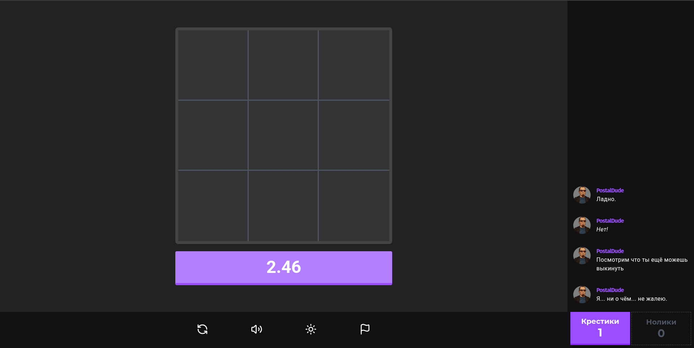

# tictactoe

[](https://vitejs.dev)
[](https://tailwindcss.com)
[](https://vitest.dev)
[](https://pnpm.io)
[](https://opensource.org/licenses/MIT)
[](https://bvbxbv.github.io/tictactoe)

[](./screenshots/postaldude_rofl.png)

Реализация игры "Крестики-нолики" с интерактивным интерфейсом и возможностью играть против AI, который может реагировать на некоторые события.

## Установка и запуск

1. Клонируем репозиторий:

```bash
git clone https://github.com/bvbxbv/tictactoe
```

2. Устанавливаем зависимости

```bash
pnpm install
```

3. Запуск проекта

```bash
pnpm run dev
```

Если не хочется устанавливать, а просто запустить, то потрогать можно [тут](https://bvbxbv.github.io/tictactoe/).

## Фичи

- Смена темы интерфейса (тёмная/светлая)
- Ограниченное время хода как для игрока, так и для AI
- Возможность сохранения настроек а также игрового поля и чата
- AI с некоторым шансом реагирует на события:
    - Конец игры: победа / поражение / ничья (реплики зависят от результата)
    - Занятие центра или создание неудобной позиции для игрока
    - Отсутствие выгодной позиции
    - Необходимость защиты от хода игрока

- У AI есть несколько пресетов реплик:
    - hannibal
    - heizenberg
    - postal dude
    - tyler durden
    - tywin lanister

## Технологии

- JavaScript
- Tailwind CSS
- Vite
- Vitest (тестирование)
- Eslint и Prettier (качество кода)
- Commitlint (конвенциональность коммитов)
- Husky (автоматизация скриптов)
- gh-pages (деплой на github pages)

## Чему я научился?

- События - это круто. В этом проекте я попытался реализовать event driven систему, где приложение это по сути две части - логика и отображение.
- Синглтоны - зло. Да, они гарантируют что в приложении будет ровно один инстанс объекта, но такой подход может вызвать большие проблемы при тестировании. Лучшая альтернатива синглтонам - dependency injection, где зависимости внедряются сверху-вниз. В моем проекте AppOrchestrator передавал все зависимости контроллерам и вьюхам.
- Затягивать с тестами - плохая идея. Лучше всего писать тесты до того как код компонента будет готов. Да, так дольше, но больше гарантий что на дебаггинг уйдёт меньше времени.
- Перед стартом проекта лучше полчаса-час посидеть и подумать над архитектурой, чем потом импровизировать, пытаясь изобрести велосипед.
- Между теми компонентами приложения, которые могут взаимодействовать с другими компонентами, должны быть строгие контракты. Контракты должны гарантировать что в компонент передастся то что требуется и это "то что требуется" будет правильного типа, вида и т.д.
- Лучше валидировать входные и выходные данные, чем потом через часы дебаггинга обнаружить что undefined в aiName из-за того на выходе в поле объекте называется не message, а speach.
- Также попробовал кучу архитектурных паттернов:
    - singleton — сначала использовал и думал что умный. Потом на стадии тестирования понял, что вряд ли найдется человек тупее меня. Больше синглтоны не трогаю даже палкой. Очень длинной палкой. Dependency injection - лучшая альтернатива синглтонам, которую я знаю.
    - orchestrator + binder + factory - не то чтобы в таких решениях была необходимость, просто хотелось узнать что-то новое и применить на практике.
    - MVC — строго разделил модели / вьюхи / контроллеры, и это все равно не спасло от спагетти. С этого момента придерживаюсь SRP.

## License

This project is licensed under the MIT License - see the [LICENSE](LICENSE) file for details.
